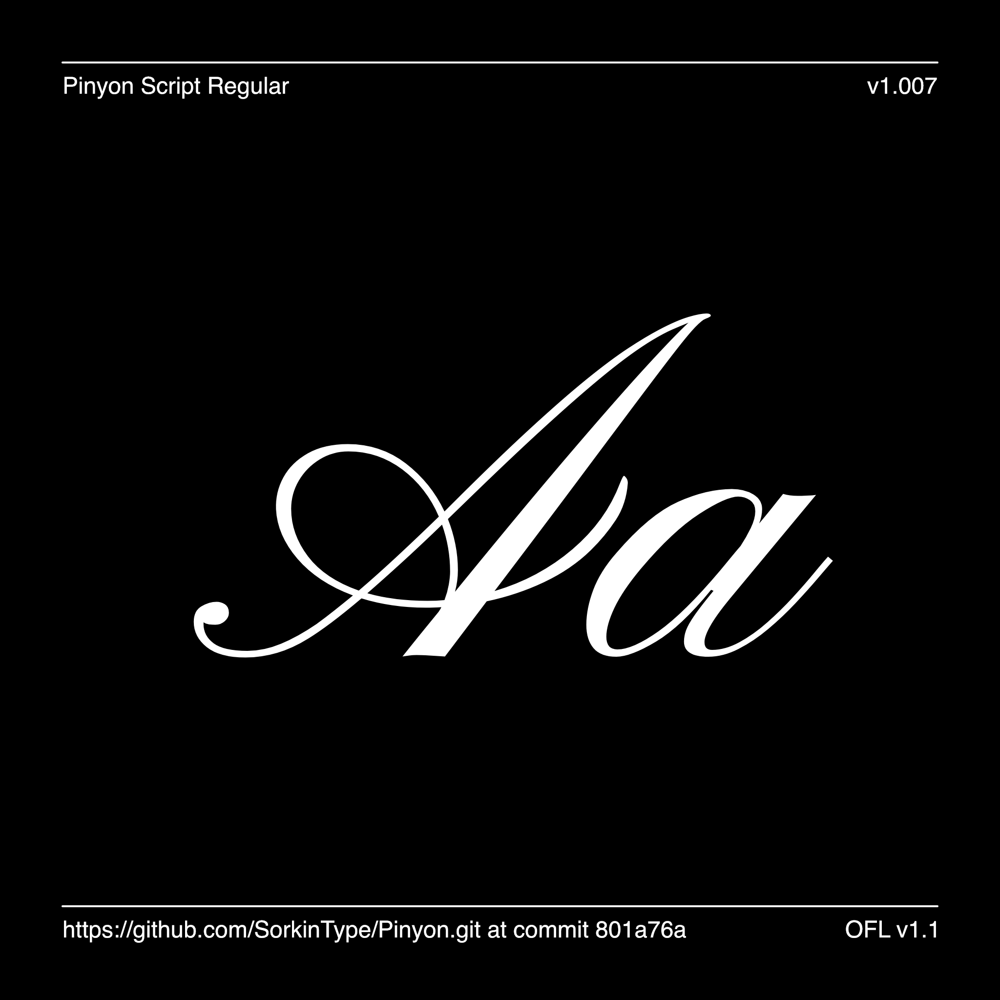

# Pinyon Script

[![][Fontbakery]](https://SorkinType.github.io/Pinyon/fontbakery/fontbakery-report.html)
[![][Universal]](https://SorkinType.github.io/Pinyon/fontbakery/fontbakery-report.html)
[![][GF Profile]](https://SorkinType.github.io/Pinyon/fontbakery/fontbakery-report.html)
[![][Outline Correctness]](https://SorkinType.github.io/Pinyon/fontbakery/fontbakery-report.html)
[![][Shaping]](https://SorkinType.github.io/Pinyon/fontbakery/fontbakery-report.html)

[Fontbakery]: https://img.shields.io/endpoint?url=https%3A%2F%2Fraw.githubusercontent.com%2FSorkinType%2FPinyon%2Fgh-pages%2Fbadges%2Foverall.json
[GF Profile]: https://img.shields.io/endpoint?url=https%3A%2F%2Fraw.githubusercontent.com%2FSorkinType%2FPinyon%2Fgh-pages%2Fbadges%2FGoogleFonts.json
[Outline Correctness]: https://img.shields.io/endpoint?url=https%3A%2F%2Fraw.githubusercontent.com%2FSorkinType%2FPinyon%2Fgh-pages%2Fbadges%2FOutlineCorrectnessChecks.json
[Shaping]: https://img.shields.io/endpoint?url=https%3A%2F%2Fraw.githubusercontent.com%2FSorkinType%2FPinyon%2Fgh-pages%2Fbadges%2FShapingChecks.json
[Universal]: https://img.shields.io/endpoint?url=https%3A%2F%2Fraw.githubusercontent.com%2FSorkinType%2FPinyon%2Fgh-pages%2Fbadges%2FUniversal.json

Pinyon Script is a romantic English round hand script font. It also sports swashes which are confident and showy somehow giving the type a feeling suggestive of the American west. Perhaps this is why, despite refinement and aristocratic style; Pinyon Script manages to feel so friendly. Nicole Script uses a high stroke contrast and is very slanted making it most suitable for use at larger sizes.

## About

Nicole Fally / typeface + graphic design‹ is a design studio specialized in typeface design. Nicole Fally studied Communication Design in Vienna, Austria, at ›Die Graphische‹ and Typeface Design at the University of Reading, UK. The studio was founded in 2004 and is now based in Bielefeld and Vienna.

Eben Sorkin designs and art directs typefaces. 

## Languages

==============================================
According to Hyperglot made by Rosetta Type the Pinyon Script has base support for 326 of the 459 languages of Latin script. These include:

Arbëreshë Albanian, Eastern Abnaki, Afar, Arvanitika Albanian, Western Abnaki, Achinese, Achuar-Shiwiar, Acheron, Eastern Arrernte, Afrikaans, Aguaruna, Gheg Albanian, Tosk Albanian, Amahuaca, Yanesha', Amis, Amarakaeri, Uab Meto, Apinayé, Aragonese, Mapudungun, Asu (Tanzania), Asturian, Waorani, Anuta, Southern Aymara, Central Aymara, Balinese, Batak Toba, Bemba (Zambia), Bena (Tanzania), Bari, Bikol, Bini, Bislama, Bosnian, Breton, Batak Dairi, Batak Mandailing, Batak Simalungun, Batak Karo, Garifuna, Catalan, Chachi, Chavacano, Cashibo-Cacataibo, Cashinahua, Candoshi-Shapra, Cebuano, Czech, Falam Chin, Chiga, Chamorro, Ojitlán Chinantec, Chuukese, Cimbrian, Chokwe, Central Kurdish, Hakha Chin, Asháninka, Montenegrin, Cofán, Cornish, Corsican, Caquinte, Pichis Ashéninka, Crimean Tatar, Seselwa Creole French, Chiltepec Chinantec, Kashubian, Tedim Chin, Welsh, Danish, Taita, German, Andaandi, Dongolawi, Dehu, Dimli, Lower Sorbian, Jola-Fonyi, Embu, Standard Estonian, English, Ese Ejja, Basque, Faroese, Nobiin, Fijian, Filipino, Finnish, Kven Finnish, French, Western Frisian, Friulian, Gagauz, Borana-Arsi-Guji Oromo, West Central Oromo, Guadeloupean Creole French, Gilbertese, Scottish Gaelic, Irish, Galician, Manx, Gooniyandi, Ga’anda, Swiss German, Wayuu, Gusii, Gwichʼin, Hän, Eastern Oromo, Haitian, Hawaiian, Northern Qiandong Miao, Hiligaynon, Southern Qiandong Miao, Hani, Caribbean Hindustani, Hopi, Croatian, Upper Sorbian, Hungarian, Huastec, Ibibio, Igbo, Iloko, Indonesian, Icelandic, Italian, Jamaican Creole English, Javanese, Shuar, Japanese, Kara-Kalpak, Kalaallisut, Kamba (Kenya), Makonde, Kabuverdianu, Kekchí, Kaingang, Khasi, Kikuyu, Kinyarwanda, Kirmanjki, Kalenjin, Kimbundu, Northern Kurdish, Kongo, Konzo, Kaonde, Karelian, Shambala, Kölsch, Kituba (DRC), Kuanyama, Ladino, Latin, Ligurian, Lithuanian, Ladin, Lombard, Latgalian, Luxembourgish, Luba-Lulua, Ganda, Luo (Kenya and Tanzania), Mizo, Standard Latvian, Madurese, Marshallese, Mam, Matsés, Meru, Mauritian Creole, Makhuwa-Meetto, Minangkabau, Mískito, Malagasy, Maltese, Montagnais, Mohawk, Maori, Totontepec Mixe, Creek, Murrinh-Patha, Mirandese, Kala Lagaw Ya, Ixcatlán Mazatec, Naga Pidgin, Neapolitan, South Ndebele, North Ndebele, Ndonga, Low German, Central Nahuatl, Niuean, Ao Naga, Dutch, Norwegian, Nomatsiguenga, Pedi, Nyanja, Nyankole, Occitan, Orma, Oroqen, Mezquital Otomi, Pampanga, Papiamento, Palauan, Páez, Picard, Pijin, Pintupi-Luritja, Paluan, Piemontese, Polish, Pohnpeian, Portuguese, Potawatomi, Upper Guinea Crioulo, Pipil, Ashéninka Perené, K'iche', Quechua, Cook Islands Māori, Balkan Romani, Vlax Romani, Romansh, Romanian, Rotokas, Rundi, Istro Romanian, Macedo-Romanian, Rwa, Sango, Samburu, Sangu (Tanzania), Sicilian, Sena, Seri, Secoya, Shipibo-Conibo, Ume Sami, Shawnee, Slovak, Slovenian, Southern Sami, Northern Sami, Lule Sami, Inari Sami, Samoan, Shona, Soninke, Somali, Southern Sotho, Spanish, Sardinian, Saramaccan, Sranan Tongo, Swati, Sundanese, Maore Comorian, Congo Swahili, Swedish, Swahili, Silesian, Tahitian, Atayal, Tetun Dili, Teso, Tetum, Tagalog, Tiv, Tokelau, Toba, Tonga (Zambia), Tojolabal, Tonga (Tonga Islands), Papantla Totonac, Tok Pisin, Tswana, Tsonga, Purepecha, Turkmen, Tumbuka, Turkish, Tuvalu, Tzeltal, Tzotzil, Meriam Mir, Umbundu, Munsee, Northern Uzbek, Venetian, Venda, Veps, Vietnamese, Makhuwa, Võro, Walser, Waray (Philippines), Warlpiri, Wik-Mungkan, Ho-Chunk, Walloon, Mwani, Wolof, Wiradjuri, Wangaaybuwan-Ngiyambaa, Xavánte, Xhosa, Kenzi, Mattokki, Soga, Yao, Yapese, Yindjibarndi, Makwe, Yoruba, Yucateco, Zapotec, Ngazidja Comorian, Malaysian, Záparo, Standard Malay, Zulu

## Building

Fonts are built automatically by GitHub Actions - take a look in the "Actions" tab for the latest build.

If you want to build fonts manually on your own computer:

* `make build` will produce font files.
* `make test` will run [FontBakery](https://github.com/googlefonts/fontbakery)'s quality assurance tests.
* `make proof` will generate HTML proof files.

The proof files and QA tests are also available automatically via GitHub Actions - look at https://SorkinType.github.io/Pinyon.

## Changelog

When you update your font (new version or new release), please report all notable changes here, with a date.
[Font Versioning](https://github.com/googlefonts/gf-docs/tree/main/Spec#font-versioning) is based on semver. 
Changelog example:

**26 May 2021. Version 2.13**
- MAJOR Font turned to a variable font.
- SIGNIFICANT New Stylistic sets added.

## License

This Font Software is licensed under the SIL Open Font License, Version 1.1.
This license is available with a FAQ at
https://scripts.sil.org/OFL

## Repository Layout

This font repository structure is inspired by [Unified Font Repository v0.3](https://github.com/unified-font-repository/Unified-Font-Repository), modified for the Google Fonts workflow.
